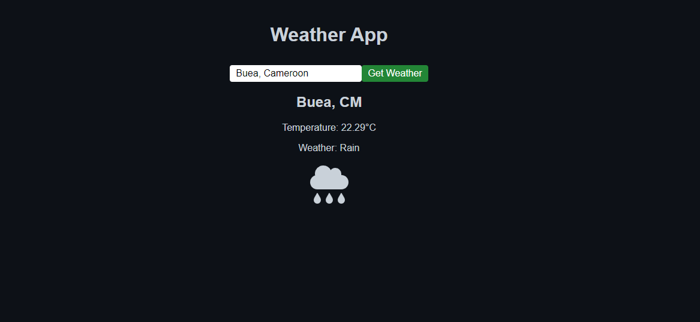
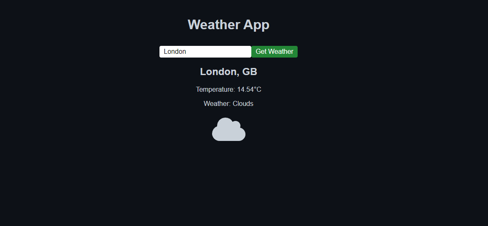
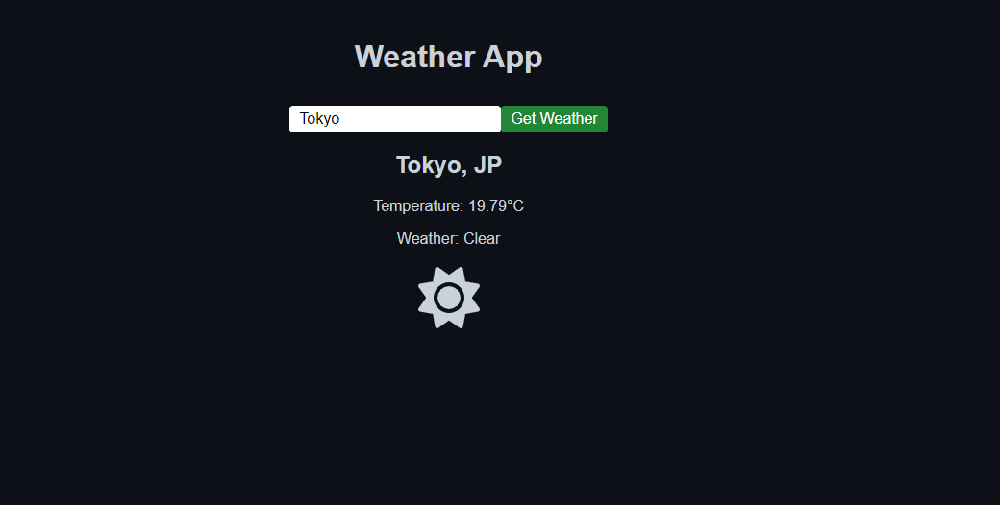

## Food Manager App

This is a frontend design of a Food Manager mobile aaplication compatible for both Android and iOS
<br/>

This Food Manager app allows us to view all avialable food items along with their quantiy in measurable units and the expiry date.



<br/>

<br/>



## Bash Commands

Here are some Bash commands you can use to set up this project:

* **Install nodejs on official website:** https://www.nodejs.org

<br/>

* **Install expo global expo cli**
  ```bash
     npm i --g expo-cli

* **Install the following dependencies in todolist path of project**
  ```bash
    npm install

* **To run project**
  ```bash
    npx expo
